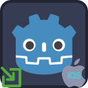

  

---
#  Deeplink Plugin

Deeplink plugin allows processing of iOS application links that enable direct navigation to requested app content.

_For Android version, visit https://github.com/cengiz-pz/godot-android-deeplink-plugin ._

##  Prerequisites
Follow instructions on the following page to prepare for iOS export:
- [Exporting for iOS](https://docs.godotengine.org/en/stable/tutorials/export/exporting_for_ios.html)

Follow instructions on the following page to associate your Godot app with your web domain:
- [Associate your Godot app with your domain](https://developer.apple.com/documentation/xcode/supporting-associated-domains)

##  Installation
There are 2 ways to install the `Deeplink` plugin into your project:
- Through the Godot Editor's AssetLib
- Manually by downloading archives from Github

###  Installing via AssetLib
Steps:
- search for and select the `Deeplink` plugin in Godot Editor
- click `Download` button
- on the installation dialog...
	- keep `Change Install Folder` setting pointing to your project's root directory
	- keep `Ignore asset root` checkbox checked
	- click `Install` button
- enable the addon via the `Plugins` tab of `Project->Project Settings...` menu, in the Godot Editor
- enable the plugin via the `iOS` section of `Project->Export...` menu, in the Godot Editor

###  Installing manually
Steps:
- download release archive from Github
- unzip the release archive
- copy to your Godot project's root directory
- enable the addon via the `Plugins` tab of `Project->Project Settings...` menu, in the Godot Editor
- enable the plugin via the `iOS` section of `Project->Export...` menu, in the Godot Editor

##  Usage
- Add `Deeplink` nodes to your scene per URL association and follow the following steps:
	- set the required field on each `Deeplink` node
		- `scheme`
		- `host`
		- `path prefix`
	- note that `scheme`, `host`, and `path prefix` must all match for a URI to be processed by the app
		- leave `path prefix` empty to process all paths in `host`
- register a listener for the `deeplink_received` signal
	- process `url`, `scheme`, `host`, and `path` data from the signal
- alternatively, use the following methods to get most recent deeplink data:
	- `get_link_url()` -> full URL for the deeplink
	- `get_link_scheme()` -> scheme for the deeplink (ie. 'https')
	- `get_link_host()` -> host for the deeplink (ie. 'www.example.com')
	- `get_link_path()` -> path for the deeplink (the part that comes after host)
- additional methods:
	- `is_domain_associated(a_domain: String)` -> returns true if your application is correctly associated with the given domain on the tested device
		- ! this method is not supported on iOS !

##  Testing
`adb shell` command can be used to simulate app links as follows:
- `$> adb shell am start -a android.intent.action.VIEW -c android.intent.category.BROWSABLE -d "https://www.example.com/mydata/path"`

##  Running demo
- After exporting demo application to an Xcode project, Xcode will require an account to be added.
	- Add an account via Xcode->Settings...->Accounts

##  Troubleshooting

### Unhandled Deeplinks
If your game is not handling your deeplinks, then make sure to revisit the [Prerequisites](#prerequisites) section.

### XCode logs
XCode logs are one of the best tools for troubleshooting unexpected behavior. View XCode logs while running your game to troubleshoot any issues.

### Troubleshooting guide
Refer to Godot's [Troubleshooting Guide](https://docs.godotengine.org/en/stable/tutorials/export/exporting_for_ios.html#troubleshooting).

   

---
#  Credits
Developed by [Cengiz](https://github.com/cengiz-pz)

Based on: [Godot iOS Plugin Template](https://github.com/cengiz-pz/godot-ios-plugin-template)

Original repository: [Godot iOS Deeplink Plugin](https://github.com/cengiz-pz/godot-ios-deeplink-plugin)

   

___

#  Contribution

This section provides information on how to build the plugin for contributors.

 

___

##  Prerequisites

- [Install SCons](https://scons.org/doc/production/HTML/scons-user/ch01s02.html)
- [Install CocoaPods](https://guides.cocoapods.org/using/getting-started.html)

 

___

##  Build

- Run `./script/build.sh -A <godot version>` initially to run a full build
- Run `./script/build.sh -cgA <godot version>` to clean, redownload Godot, and rebuild
- Run `./script/build.sh -ca` to clean and build without redownloading Godot
- Run `./script/build.sh -cb -z4.0` to clean and build plugin without redownloading Godot and package in a zip archive as version 4.0
- Run `./script/build.sh -h` for more information on the build script

 

___

##  Install Script

- Run `./script/install.sh -t <target directory> -z <path to zip file>` install plugin to a Godot project.
- Example `./script/install.sh -t demo -z bin/release/DeeplinkPlugin-v4.0.zip` to install to demo app.

 

___

##  Git addon submodule

###  Creating

- `git submodule add -b main --force --name addon https://github.com/cengiz-pz/godot-deeplink-addon.git addon`

###  Updating

- Remove `addon` directory
- Run `git submodule update --remote --merge`

 

___

##  Libraries

Library archives will be created in the `bin/release` directory.

  

---
#  All Plugins

| Plugin | Android | iOS |
| :---: | :--- | :--- |
| Notification Scheduler | https://github.com/cengiz-pz/godot-android-notification-scheduler-plugin | https://github.com/cengiz-pz/godot-ios-notification-scheduler-plugin |
| Admob | https://github.com/cengiz-pz/godot-android-admob-plugin | https://github.com/cengiz-pz/godot-ios-admob-plugin |
| Deeplink | https://github.com/cengiz-pz/godot-android-deeplink-plugin | https://github.com/cengiz-pz/godot-ios-deeplink-plugin |
| Share | https://github.com/cengiz-pz/godot-android-share-plugin | https://github.com/cengiz-pz/godot-ios-share-plugin |
| In-App Review | https://github.com/cengiz-pz/godot-android-inapp-review-plugin | https://github.com/cengiz-pz/godot-ios-inapp-review-plugin |
